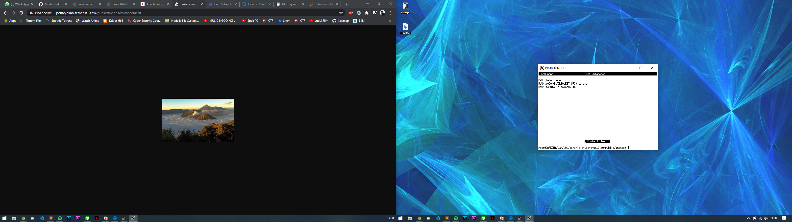

# Lapres Jaringan Komputer Kelompok T10

## Christian Andrew Tantono 05311840000017

## List IP
- IP Malang 10.151.83.162
- IP Mojokerto 10.151.83.163
- IP Probolinggo 10.151.83.164

# Penjelasan
Pada praktikum kali ini kita diharuskan membuat sebuah topologi sederhana dimana pada sisi clien terdiri dari 2 client yaitu ```Sidoarjo``` dan ```Gresik```. Pada bagian server-side ada 3 buah server yaitu ```Malang```, ```Mojokerto``` dan ```Probolinggo```. ```Malang``` fungsi nya adalah sebagai main server sementara ```Probolinggo``` berfungsi sebagai slave dan yang terakhir yaitu ```Probolinggo``` yang berfungsi sebagai web server. Client dan server-side di hubungkan dengan router ```Surabaya```.


# Task 1

Kita diminta untuk membuat sebuah domain utama dengan alamat ```http://semerut10.pw``` pada server malang. Pada gambar dibawah ini kita hanya perlu membuat sebuah zone baru yaitu ``semerut10.pw`` dan tipe yang digunakan adalah master karena merupakan main server. Berikutnya, ada perintah also notify dan juga allow transfer dari ``IP Mojokerto`` yang berfugsi untuk menghubungkan antara UML Malang dan UML Mojokerto dikarenakan UML Mojokerto adalah slave dari UML Malang.


Berikutnya hal yang perlu kita lakukan adalah mengubah nameserver yang ada pada client dengan cara mengetikkan ``nano /etc/resolf.conf`` seperti gambar di bawah ini.


# Task 2
Berikutnya kita diminta untuk membuat alias dari ``semerut10.pw`` menjadi ``www.semerut10.pw`` dimana kita harus menggunakan `CNAME` agar www bisa di akses. 


Setelah berhasil membuat CNAME maka berikutnya yang akan kita lakukan adalah test ping dengan cara mengetikkan ```ping semeru.pw```


Selain ```ping semeru.pw``` kita juga perlu melakukan ping ke ```ping www.semeru.pw``` untuk melakukan pencekan apakah CNAME kita berjalan dengan baik.

# Task 3
Pada task ke 3 ini yang perlu kita lakukan adalah membuat sebuah sub domain yaitu ``penanjakan.semerut10.pw``. Cara melakukan setting nya adalah dengan masuk kembali ke UML Malang dan mengecek file ``/etc/bind/semeru/semerut10.pw``dimana kita menambah penanjakan yang mengarahkan ke IP dari UML Probolinggo.


# Task 4
Pada task ke 4 ini kita diminta untuk membuat reverse domain untuk domain utama. Cara nya adalah dengan masuk ke UML Probolinggo dan ketikkan perintah ``` nano etc/bind/named.conf.local``` dan kita hanya perlu membuat zone baru dengan type master. Selanjut nya kita perlu membuat config nya yaitu dengan mengetikkan ```nano /etc/bind/semeru/83.151.10.in-addr.arpa``` dan kita isikan ip ke 4 dari UML Malang.


# Task 5
Pada task ke 5 ini kita diminta untuk membuat DNS server slave pada UML Mojokerto dimana kita perlu masuk ke ``` nano etc/bind/named.conf.local``` dan kita bisa memasang zone ``semerut10.pw``.


# Task 6
Pada task ke 6 kita diminta untuk membuat subdomain ``gunung.semerut10.pw`` yang di buat pada UML Mojokerto dan mengarah ke IP Probolinggo.


# Task 7
Berikutnya kita juga diminta membuat subdomain dengan nama ``naik.gunung.semerut10.pw`` dan diarahkan ke IP Probolinggo. Dikarenakan tidak ada keterangan mau di set dimana maka saya set subdomain nya pada UML Malang.


# Task 8 
Pada task kali ini kita mulai mengatur web server yang berarti UML yang akan kita gunakan saat ini adalah UML Probolinggo.


# Task 9 
Pada task kali ini kita diminta untuk melakukan mod rewrite agar urlnya menjadi `http://semerut10.pw/home`. Mod rewrite sendiri kita cukup mengetikkan 

```
RewriteEngine On
RewriteCond %{REQUEST_FILENAME} !-d
RewriteRule ^([^\.]+)$ $1.php [NC,L]
```
sehingga ketika kita mengetikkan ``index.php`` akan langsung di rubah.


# Task 10
untuk task 10 kita hanya perlu membuat susunan folder sesuai dengan yang diminta.


# Task 11
Pada task 11 ini kita diminta untuk melakukan setting htaccess agar folder yang berada di dalam public.


# Task 12
Pada task 12 ini kita diminta untuk merename error code 404 dengan html yang sudah di sediakan.


# Task 13 
Kali ini kita juga harus melakukan pengaturan terhadap akses file yaitu memperpendek link url agar lebih mudah ketika di akses.


# Task 14
Task kali ini kita harus mengubah akses agar hanya bisa di akses melalui port 8888.


# Task 15
Pada task kali ini kita diminta membuat autentikasi password namun karena tidak ada arahan apakah yang akan digunakan maka saya membuat 2 autentikasi dimana pertama saya menggunakan website biasa dengan session agar tidak bisa di bypass. 


# Task 16
Pada task 16 kita harus merubah IP Probolinggo menjadi secara otomatis menuju ke `semerut10.pw`.


# Task 17
Task terakhir ini kita diminta untuk membuat semua substring yang ada tulisan ```Semeru``` maka akan langsung melakukan direct ke gambar ```semeru.jpg```.


